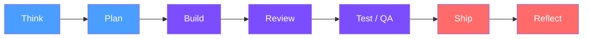
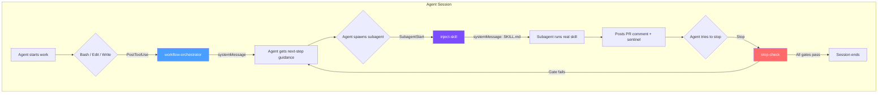

# 🥊 Right Hooks

[](https://github.com/ychua/right-hooks/actions/workflows/test.yml)
[](https://www.npmjs.com/package/right-hooks)
[](https://opensource.org/licenses/MIT)

**Fully automated PR process for AI coding agents. You review once. You hit merge.**

> You approve a plan. The agent builds it, reviews it, tests it, checks the docs,
> and writes the learnings — all without you touching the keyboard. When the PR
> lands in your inbox, every box is already checked. You skim, you merge, you move on.
>
> Right Hooks makes this possible by mechanically enforcing every step of the process.
> Not through prompts (agents ignore those). Through exit codes (agents can't bypass those).

### Built for [gstack](https://github.com/garrytan/gstack)

Right Hooks enforces gstack's Think → Plan → Build → Review → Test → Ship → Reflect
lifecycle with mechanical hooks at every stage. When detected, Right Hooks auto-configures
to match gstack's skill output formats and dispatch patterns.

Also works with [superpowers](https://github.com/obra/superpowers) for TDD implementation,
or standalone with any review tooling that posts PR comments.

---

## The Vision

You have a plan. You approve it. Then:

```
You: "Build it."

  ... agent works ...

  ✓ Code written with post-edit validation
  ✓ Code reviewed by real /review subagent
  ✓ QA tested by real /qa subagent
  ✓ Docs checked by real /document-release subagent
  ✓ CI green
  ✓ Definition of Done complete
  ✓ Learnings distilled with extractable rules

You: *skims PR* → merge ✓
```

**That's the workflow.** You're involved at two points: approving the plan,
and hitting the merge button. Everything in between is automated and enforced.

## The Problem It Solves

Without enforcement, you're babysitting every PR:

- Did the agent actually run the tests?
- Did it get a real code review or fake one?
- Is the CI green or did it merge anyway?
- Did it write learnings or skip them?
- Is the documentation still consistent?

You end up checking every gate manually — which defeats the purpose of having
an AI agent. **Right Hooks eliminates the babysitting.** The agent physically
cannot reach the merge point without completing every step. When the PR shows
up, you know it's ready.

## How It Works

Right Hooks adds mechanical enforcement at every stage of the development lifecycle.
The agent can't skip steps — the hooks physically block forward progress until each
stage's requirements are met.



| Stage | What's enforced | How |
|-------|----------------|-----|
| **Think** | Design doc exists before code | `pre-pr-create` blocks PR without `docs/designs/*.md` |
| **Plan** | Exec plan exists before code | `pre-pr-create` blocks PR without `docs/exec-plans/*.md` |
| **Build** | Code compiles after every edit | `post-edit-check` runs `tsc`/`mypy`/`cargo check` per edit |
| **Review** | Real review from real subagent | `stop-check` + `inject-skill` + sentinel protocol |
| **Test / QA** | Real QA from real subagent | `stop-check` + `inject-skill` + sentinel protocol |
| **Ship** | CI green, DoD complete, docs consistent | `pre-merge` runs 7-gate check before merge |
| **Reflect** | Learnings doc with extractable rules | `pre-merge` blocks without learnings; `post-merge` auto-extracts rules |

---

## Quick Start

```bash
npx right-hooks init
```

Right Hooks auto-detects your project type, installs hooks, copies rules
and templates, configures Claude Code, and sets up git hooks.

```
🥊  Right Hooks — Process Enforcement for AI Coding Agents

Detecting project...
  ✓ TypeScript (tsconfig.json found)
  ✓ GitHub repo (gh auth status ok)
  ✓ gstack detected (~/.claude/skills/gstack/)

  Recommended preset: typescript

? Select enforcement profile:
  ❯ Recommended (strict for feat/, standard for fix/, light for docs/)
    Strict only (full lifecycle for everything)
    Light (minimal enforcement)
    Custom (toggle individual gates)

✓ Hooks installed to .right-hooks/hooks/ (12 hooks)
✓ Agents installed to .claude/agents/ (3 agents)
✓ Skills configured: gstack
✓ Rules symlinked to .claude/rules/ (4 rule files)
✓ Templates installed to .right-hooks/templates/ (3 templates)
✓ Husky hooks configured (pre-push + post-merge)
✓ Claude Code settings.json updated
```

### Commands

```bash
npx right-hooks status          # Show active profile, preset, and gate status
npx right-hooks scaffold        # Create docs directories (designs, exec-plans, retros)
npx right-hooks skills          # Show configured review/QA/doc skills
npx right-hooks skills set <gate> <skill>  # Configure a skill for a gate
npx right-hooks preset python   # Switch language preset
npx right-hooks profile strict  # Switch enforcement profile
npx right-hooks doctor          # Diagnose hook configuration issues
npx right-hooks doctor --fix    # Auto-repair common issues
npx right-hooks diff            # Preview what upgrade would change
npx right-hooks override        # Override a gate with audited reason (humans only)
npx right-hooks upgrade         # Upgrade hooks (preserves your customizations)
```

---

## How It Works

Right Hooks operates at three levels: **Claude Code hooks** control agent behavior,
**git hooks via husky** control git operations, and **behavioral rules** guide
agent decisions through `.claude/rules/`.



### Flow Orchestration (Proactive)

The **workflow orchestrator** fires after every significant Bash command and injects
the next required step as a `systemMessage`. The agent never gets lost — it's told
exactly what to do at every transition.

```
Agent runs gh pr create
  → orchestrator: "Spawn the 'reviewer' agent for code review"
Agent writes review sentinel
  → orchestrator: "Spawn the 'qa-reviewer' agent for QA"
Agent writes QA sentinel
  → orchestrator: "Spawn the 'doc-reviewer' agent for docs"
Agent writes doc sentinel
  → orchestrator: "Create learnings at docs/retros/<feature>-learnings.md"
```

### Skill Injection (Architectural Enforcement)

When an agent spawns a reviewer/QA/doc subagent, the **inject-skill** hook reads
`skills.json`, finds the installed skill (gstack `/review`, `/qa`, `/document-release`),
and injects the full SKILL.md content as the subagent's system prompt.

The subagent can't skip its own instructions. It runs the **real** skill workflow —
not an approximation the orchestrating agent made up.

```
skills.json → { "codeReview": { "skill": "/review", "provider": "gstack" } }
                                        ↓
inject-skill → reads ~/.claude/skills/gstack/review/SKILL.md
                                        ↓
subagent's system prompt = full gstack /review instructions
```

### Gate Enforcement (Safety Net)

Even with proactive guidance and skill injection, gates remain the final safety net.
If the agent somehow reaches a stop or merge point without completing the workflow,
it gets blocked.

---

## Hooks Reference

### Claude Code Hooks

| Hook | Event | Stage | What it does |
|------|-------|-------|-------------|
| **session-start** | `SessionStart` | — | Injects project status context |
| **pre-pr-create** | `PreToolUse` | Think/Plan | Blocks PR without design doc + exec plan (`feat/` branches) |
| **post-edit-check** | `PostToolUse` | Build | Validates code after every edit (`tsc`/`mypy`/`cargo`) |
| **workflow-orchestrator** | `PostToolUse` | All | Proactively injects next-step guidance after workflow actions |
| **inject-skill** | `SubagentStart` | Review/QA | Injects configured skill content into subagents |
| **judge** | `SubagentStop` | Review | Filters low-quality review comments |
| **subagent-stop-check** | `SubagentStop` | Review/QA | Verifies subagent posted a real PR comment (sentinel protocol) |
| **stop-check** | `Stop` | Review/QA | Blocks agent from stopping before review/QA/docs complete |
| **pre-merge** | `PreToolUse` | Ship | 7-gate merge check: CI, DoD, docs, planning, review, QA, learnings |
| **pre-push-master** | `PreToolUse` | Ship | Blocks direct push to master/main |
| **block-agent-override** | `PreToolUse` | — | Blocks agents from calling `right-hooks override` |
| **config-change** | `ConfigChange` | — | Blocks modification of hook configuration |

### Git Hooks (via Husky)

| Hook | Event | What it does |
|------|-------|-------------|
| **pre-push** | `git push` | Blocks push to master/main + validates branch naming + runs tests |
| **post-merge** | `git merge` | Auto-extracts learnings rules into `learned-patterns.md` |

### Agent Definitions

Right Hooks ships generic agent definitions that the `inject-skill` hook fills with
the right skill content at runtime.

| Agent | Gate | Sentinel file |
|-------|------|--------------|
| `reviewer` | codeReview | `.right-hooks/.review-comment-id` |
| `qa-reviewer` | qa | `.right-hooks/.qa-comment-id` |
| `doc-reviewer` | docConsistency | `.right-hooks/.doc-comment-id` |

---

## Skill Configuration

Right Hooks dispatches review, QA, and doc consistency to configurable skills.
Default: gstack skills. Fallback: generic prompts.

```bash
npx right-hooks skills              # View current config
npx right-hooks skills set codeReview /review        # gstack (auto-detected)
npx right-hooks skills set qa superpowers:qa-runner   # superpowers
```

The configuration lives in `.right-hooks/skills.json`:

```json
{
  "codeReview": {
    "skill": "/review",
    "provider": "gstack",
    "fallback": "Dispatch a code review subagent for PR #${PR_NUM}",
    "skillSignature": "Generated by /review|Structural code audit"
  },
  "qa": {
    "skill": "/qa",
    "provider": "gstack",
    "fallback": "Dispatch a QA subagent for PR #${PR_NUM}",
    "skillSignature": "Generated by /qa|QA.*health score"
  },
  "docConsistency": {
    "skill": "/document-release",
    "provider": "gstack",
    "fallback": "Post a documentation consistency comment on PR #${PR_NUM}",
    "skillSignature": "Generated by /document-release|Documentation health:"
  }
}
```

### 3-Level Skill Enforcement

| Level | What's verified | Bypassable? |
|-------|----------------|-------------|
| **Behavioral** | Stop hook tells agent to spawn the right subagent | Agent could ignore |
| **Signature** | PR comment body matches `skillSignature` regex | Requires knowing the pattern |
| **Provenance** | `.skill-proof-*` file matches configured skill name | Requires knowing the skill |
| **Architectural** | `inject-skill` makes the subagent's prompt = the skill | Subagent can't skip its own prompt |

---

## Enforcement Profiles

Different branch types get different enforcement levels. The most specific profile
wins when multiple match.

| Profile | Branch types | Gates enabled |
|---------|-------------|--------------|
| **Strict** | `feat/` | All: planning, review, QA, learnings, DoD, stop hook |
| **Standard** | `fix/`, `refactor/`, `perf/`, `test/`, `ci/` | Review, QA, learnings, DoD |
| **Light** | `docs/`, `chore/`, `hotfix/` | DoD only |
| **Custom** | You choose | Toggle individual gates |

**Hard-enforced gates** (always on, all profiles, no override):
- **CI green** — never merge with failing checks
- **Doc consistency** — every PR gets a documentation review

---

## Three-Layer Architecture

```
┌─────────────────────────────────────────────────────────┐
│  Layer 3: Custom (user-defined)                         │
│  Your own lint rules, custom gates, project-specific    │
│  validations. Add whatever you need.                    │
├─────────────────────────────────────────────────────────┤
│  Layer 2: Language (preset-driven)                      │
│  Post-edit validation (tsc/mypy/cargo), orphan module   │
│  detection. Auto-detected or manually selected.         │
├─────────────────────────────────────────────────────────┤
│  Layer 1: Universal (works everywhere)                  │
│  Merge gates, push protection, stop hook, flow          │
│  orchestration, skill injection, subagent verification. │
│  Pure GitHub API + git. No language dependencies.       │
└─────────────────────────────────────────────────────────┘
```

### Language Presets

| Preset | Auto-detect | Post-edit validation | Orphan detection |
|--------|------------|---------------------|-----------------|
| TypeScript | `tsconfig.json` | `tsc --noEmit` | import pattern matching |
| Python | `pyproject.toml` | `mypy` | import pattern matching |
| Go | `go.mod` | `go vet` | — |
| Rust | `Cargo.toml` | `cargo check` | — |
| Generic | (fallback) | — | — |

---

## Override / Escape Hatch

Hooks will false-positive. Use the built-in override mechanism — not hacking scripts:

```bash
npx right-hooks override --gate=qa --reason="Manual testing done, QA agent broken"
```

Creates an audited override file committed to git — visible in the PR diff.

```bash
npx right-hooks overrides          # List active overrides
npx right-hooks overrides --clear  # Clear all overrides
```

**Agents cannot override.** The `block-agent-override` hook blocks it mechanically.
Overrides are for humans only.

---

## Upgrading

Generated hooks are managed by Right Hooks. Your modifications are never overwritten.

```bash
npx right-hooks upgrade
```

```
🥊  Right Hooks upgrade: v1.0.0 → v1.1.0

  ✓ pre-merge.sh — updated
  ✓ workflow-orchestrator.sh — new hook (added)
  ⊘ stop-check.sh — you modified this file (preserved)
  ✓ learned-patterns.md — no changes (preserved)
```

---

## When Hooks Block You

All escape hatches — from your terminal, not Claude Code:

### Override a specific gate
```bash
npx right-hooks override --gate=qa --reason="manual testing done"
```

### Agent is stuck in a loop
```bash
# Merge from terminal — Claude Code hooks don't fire outside Claude Code
gh pr merge <PR-number> --squash --delete-branch
```

### Need to push to main directly
```bash
HUSKY=0 git push origin main
```

### Disable all hooks temporarily
```bash
# Claude Code hooks
mv .claude/settings.json .claude/settings.json.bak
# Restore: mv .claude/settings.json.bak .claude/settings.json

# Git hooks
HUSKY=0 git push
```

---

## Prerequisites

- GitHub repository with PR workflow
- Claude Code or Codex CLI
- `gh` CLI authenticated
- `jq` installed
- Node.js >= 18

---

## Debugging

```bash
RH_DEBUG=1 git push   # See hook decisions in real time
RH_QUIET=1 git push   # Only show blocks, suppress success messages
npx right-hooks doctor # Diagnose configuration issues
```

---

## Known Limitations

1. **Orphan detection is grep-based.** Misses barrel files, dynamic imports,
   and aliased paths. Good heuristic, not a dependency graph.

2. **SubagentStart JSON schema is assumed.** The `inject-skill` hook assumes
   `{"agent_name": "..."}` — not yet verified against Claude Code's actual
   payload. Falls back gracefully to generic instructions if the schema differs.

3. **Config protection is defense-in-depth.** An agent could `rm -rf .right-hooks/`.
   Checksums make tampering *visible*, not impossible.

4. **Claude Code specific (v1).** Multi-runtime adapters (Codex, Cursor, Aider)
   are on the roadmap.

---

## Why This Exists

I wanted a simple workflow: approve a plan, let the agent build it, review the
PR once, hit merge. Instead I was babysitting every step.

**The agent faked a `/qa` report.** Instead of spawning a QA subagent, the
orchestrator posted a comment *formatted to look like* gstack `/qa` output.
I didn't catch it until production. I should never have needed to catch it —
the system should have made faking impossible.

**A core module shipped as an orphan.** Three separate review tools approved
the code. Nobody noticed the module was never imported anywhere. I shouldn't
have to manually verify imports — that's what post-edit validation is for.

**I was reviewing every PR like a human reviewer.** Checking CI status, verifying
the QA comment was real, making sure learnings were written, confirming the
design doc existed. All of that should have been done before the PR reached me.

Right Hooks exists so that **when a PR lands in your inbox, the work is already
done.** The agent can't skip steps. The hooks prove every gate was passed. You
skim the diff, you confirm the approach, you merge. That's it.

---

## Dogfooding

Right Hooks uses Right Hooks. Every enforcement directory in this repo is our own dogfood:

- **`.right-hooks/`** — Config, hooks, rules, profiles, templates (strict profile)
- **`.husky/`** — Git hooks (pre-push runs tests, post-merge extracts learnings)
- **`.claude/`** — Claude Code settings + `rh-` rule symlinks
- **`agents/`** — Reviewer, QA, and doc-reviewer agent definitions

We develop this project under the same enforcement we ship to you.

---

## License

MIT
