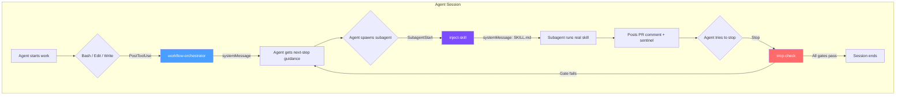

# 🥊 Right Hooks

[](https://github.com/ychua/right-hooks/actions/workflows/test.yml)
[](https://www.npmjs.com/package/right-hooks)
[](https://opensource.org/licenses/MIT)

**Let your AI agent run for long periods of time. Come back to a ready-to-merge PR.**

> The bottleneck in AI-assisted development isn't the agent — it's you. Every time
> the agent needs approval, every time you check if it really ran the tests, every
> time you verify the review comment is real — that's you being the bottleneck.
>
> Right Hooks removes you from the loop. You approve a plan, walk away, and come
> back to a PR where every gate has been mechanically enforced. The agent can't
> cut corners because the hooks won't let it. You skim, you merge, you move on.

```
You: "Here's the plan. Build it."     ← you're done

  ... time passes ...                  ← you're doing something else

  ✓ Code written with post-edit validation
  ✓ Code reviewed by a real review subagent
  ✓ QA tested by a real QA subagent
  ✓ Docs checked by a real doc subagent
  ✓ CI green
  ✓ Definition of Done — every item checked
  ✓ Learnings distilled with extractable rules

  PR lands in your inbox              ← everything already done

You: *skims diff* → merge ✓           ← 2 minutes
```

**Two touchpoints.** Approve the plan. Hit merge. Everything in between is
autonomous, multi-agent, and mechanically enforced.

## Quick Start

```bash
npm install right-hooks
npx right-hooks init
```

[View on npm](https://www.npmjs.com/package/right-hooks)

Right Hooks auto-detects your project type, installs hooks, copies rules
and templates, configures Claude Code, and sets up git hooks.

```
🥊  Right Hooks — Process Enforcement for AI Coding Agents

Detecting project...
  ✓ TypeScript (tsconfig.json found)
  ✓ GitHub repo (gh auth status ok)
  ✓ gstack detected (~/.claude/skills/gstack/)

  Recommended preset: typescript

? Select enforcement profile:
  ❯ Recommended (strict for feat/, standard for fix/, light for docs/)
    Strict only (full lifecycle for everything)
    Light (minimal enforcement)
    Custom (toggle individual gates)

✓ Hooks installed to .right-hooks/hooks/ (12 hooks)
✓ Agents installed to .claude/agents/ (3 agents)
✓ Skills configured: gstack
✓ Rules symlinked to .claude/rules/ (4 rule files)
✓ Templates installed to .right-hooks/templates/ (3 templates)
✓ Husky hooks configured (pre-push + post-merge)
✓ Claude Code settings.json updated
```

### Commands

```bash
npx right-hooks status          # Show active profile, preset, and gate status
npx right-hooks scaffold        # Create docs directories (designs, exec-plans, retros)
npx right-hooks skills          # Show configured review/QA/doc skills
npx right-hooks skills set <gate> <skill>  # Configure a skill for a gate
npx right-hooks preset python   # Switch language preset
npx right-hooks profile strict  # Switch enforcement profile
npx right-hooks doctor          # Diagnose hook configuration issues
npx right-hooks doctor --fix    # Auto-repair common issues
npx right-hooks stats           # Show gate effectiveness metrics and human involvement
npx right-hooks explain <gate>  # Explain what a gate checks and how to fix blocks
npx right-hooks explain         # List all gates with per-profile status
npx right-hooks diff            # Preview what upgrade would change
npx right-hooks override        # Override a gate with audited reason (humans only)
npx right-hooks upgrade         # Upgrade hooks (preserves your customizations)
```

---

### Process Enforcement for Claude Code

Autonomous doesn't mean sloppy. Every change goes through a full PR lifecycle —
design doc, implementation, code review, QA, documentation check, learnings —
the same process a senior engineer would follow, enforced mechanically so the
agent can't skip steps even when running unsupervised.

Enforces the **Think → Plan → Build → Review → Test → Ship → Reflect**
lifecycle with mechanical hooks at every stage. Works with Claude Code today,
with multi-runtime support (Codex, Cursor, Aider) on the roadmap.

### Integrations

- **[gstack](https://github.com/garrytan/gstack)** — Best-in-class integration. Auto-configures skill dispatch, signature patterns, and workflow orchestration when detected.
- **[superpowers](https://github.com/obra/superpowers)** — TDD implementation, subagent-driven development, plan execution.
- **Standalone** — Works with any review tooling that posts PR comments.

---

## Why Autonomous Agent Runs Need Enforcement

Long-running agents are powerful — but only if you can trust the output. Without
enforcement, you're babysitting:

- Did the agent actually run the tests, or skip them?
- Did it get a real code review, or fake one?
- Is CI green, or did it try to merge anyway?
- Did it write learnings, or skip the last 10%?
- Is the documentation still consistent?

The longer the agent runs unsupervised, the more these questions compound. You
end up reviewing every PR like a detective — which defeats the entire point of
autonomous agents.

**Right Hooks makes unsupervised runs safe.** The agent physically cannot reach
the merge point without completing every step. Not through prompts (agents ignore
those). Through exit codes (agents can't bypass those). When the PR shows up, you
know it's ready — because the hooks already proved it.

### The Human Supervision Problem

Without Right Hooks, human attention is the bottleneck in AI-assisted development:

```
Agent works → needs approval → you context-switch → agent continues → needs check
→ you context-switch → agent finishes → you verify everything → merge
```

Every interruption costs you 15-30 minutes of context. The agent is fast, but
you're serialized across every PR.

**With Right Hooks, the agent runs end-to-end:**

```
You approve plan → agent builds + reviews + tests + documents autonomously → PR ready → you merge
```

You review once. You merge once. You move on to the next plan.

## How It Enables Autonomous Runs

Right Hooks turns a single agent session into a full multi-agent pipeline — build,
review, test, document — with no human intervention between plan approval and merge.


The green steps are you. The purple steps are autonomous. Every transition between
agents is enforced by hooks — the orchestrating agent can't skip a step, and each
subagent runs the **real** skill (not an approximation the parent agent made up).

| Stage | What's enforced | How |
|-------|----------------|-----|
| **Think** | Design doc exists before code | `pre-pr-create` blocks PR without `docs/designs/*.md` |
| **Plan** | Exec plan with Definition of Done | `pre-pr-create` blocks PR without `docs/exec-plans/*.md` |
| **Build** | Code compiles after every edit | `post-edit-check` runs `tsc`/`mypy`/`cargo check` per edit |
| **Review** | Real review from real subagent | `inject-skill` + sentinel protocol — can't be faked |
| **Test / QA** | Real QA from real subagent | `inject-skill` + sentinel protocol — can't be faked |
| **Ship** | CI green, DoD complete, docs consistent | `pre-merge` runs 7-gate check before merge |
| **Reflect** | Learnings doc with extractable rules | `pre-merge` blocks without learnings; `post-merge` auto-extracts rules |

---

## Multi-Agent Orchestration

The key to long autonomous runs is **multi-agent orchestration with mechanical
guarantees.** Right Hooks operates at three levels: **Claude Code hooks** control
agent behavior, **git hooks via husky** control git operations, and **behavioral
rules** guide agent decisions through `.claude/rules/`.



### Flow Orchestration (Proactive)

The **workflow orchestrator** fires after every significant Bash command and injects
the next required step as a `systemMessage`. The agent never gets lost — it's told
exactly what to do at every transition.

```
Agent runs gh pr create
  → orchestrator: "Spawn the 'reviewer' agent for code review"
Agent writes review sentinel
  → orchestrator: "Spawn the 'qa-reviewer' agent for QA"
Agent writes QA sentinel
  → orchestrator: "Spawn the 'doc-reviewer' agent for docs"
Agent writes doc sentinel
  → orchestrator: "Create learnings at docs/retros/<feature>-learnings.md"
```

### Skill Injection (Architectural Enforcement)

When an agent spawns a reviewer/QA/doc subagent, the **inject-skill** hook reads
`skills.json`, finds the installed skill (gstack `/review`, `/qa`, `/document-release`),
and injects the full SKILL.md content as the subagent's system prompt.

The subagent can't skip its own instructions. It runs the **real** skill workflow —
not an approximation the orchestrating agent made up.

```
skills.json → { "codeReview": { "skill": "/review", "provider": "gstack" } }
                                        ↓
inject-skill → reads ~/.claude/skills/gstack/review/SKILL.md
                                        ↓
subagent's system prompt = full gstack /review instructions
```

### Gate Enforcement (Safety Net)

Even with proactive guidance and skill injection, gates remain the final safety net.
If the agent somehow reaches a stop or merge point without completing the workflow,
it gets blocked.

---

## Hooks Reference

### Claude Code Hooks

| Hook | Event | Stage | What it does |
|------|-------|-------|-------------|
| **session-start** | `SessionStart` | — | Injects project status context |
| **pre-pr-create** | `PreToolUse` | Think/Plan | Blocks PR without design doc + exec plan (`feat/` branches) |
| **post-edit-check** | `PostToolUse` | Build | Validates code after every edit (`tsc`/`mypy`/`cargo`) |
| **workflow-orchestrator** | `PostToolUse` | All | Proactively injects next-step guidance after workflow actions |
| **agent-spawn-guard** | `PreToolUse` | — | Defense-in-depth guard for agent spawning (blocks dangerous patterns) |
| **inject-skill** | `SubagentStart` | Review/QA | Injects configured skill content into subagents via `agent_type` |
| **judge** | `SubagentStop` | Review | Filters low-quality review comments |
| **subagent-stop-check** | `SubagentStop` | Review/QA | Verifies subagent posted a real PR comment (sentinel protocol) |
| **stop-check** | `Stop` | Review/QA | Blocks agent from stopping before review/QA/docs complete |
| **stop-failure-logger** | `StopFailure` | — | Logs agent death events (rate limits, auth failures) for stats |
| **pre-merge** | `PreToolUse` | Ship | 7-gate merge check: CI, DoD, docs, planning, review, QA, learnings |
| **pre-push-master** | `PreToolUse` | Ship | Blocks direct push to master/main |
| **block-agent-override** | `PreToolUse` | — | Blocks agents from calling `right-hooks override` |
| **block-scheduling** | `PreToolUse` | — | Blocks agents from scheduling autonomous runs (CronCreate, RemoteTrigger) |
| **config-change** | `ConfigChange` | — | Blocks modification of hook configuration |

### Git Hooks (via Husky)

| Hook | Event | What it does |
|------|-------|-------------|
| **pre-push** | `git push` | Blocks push to master/main + validates branch naming + runs tests |
| **post-merge** | `git merge` | Auto-extracts learnings rules into `learned-patterns.md` |

### Agent Definitions

Right Hooks ships generic agent definitions that the `inject-skill` hook fills with
the right skill content at runtime.

| Agent | Gate | Sentinel file |
|-------|------|--------------|
| `reviewer` | codeReview | `.right-hooks/.review-comment-id` |
| `qa-reviewer` | qa | `.right-hooks/.qa-comment-id` |
| `doc-reviewer` | docConsistency | `.right-hooks/.doc-comment-id` |

---

## Skill Configuration

Right Hooks dispatches review, QA, and doc consistency to configurable skills.
Default: gstack skills. Fallback: generic prompts.

```bash
npx right-hooks skills              # View current config
npx right-hooks skills set codeReview /review        # gstack (auto-detected)
npx right-hooks skills set qa superpowers:qa-runner   # superpowers
```

The configuration lives in `.right-hooks/skills.json`:

```json
{
  "codeReview": {
    "skill": "/review",
    "provider": "gstack",
    "fallback": "Dispatch a code review subagent for PR #${PR_NUM}",
    "skillSignature": "Generated by /review|Structural code audit"
  },
  "qa": {
    "skill": "/qa",
    "provider": "gstack",
    "fallback": "Dispatch a QA subagent for PR #${PR_NUM}",
    "skillSignature": "Generated by /qa|QA.*health score"
  },
  "docConsistency": {
    "skill": "/document-release",
    "provider": "gstack",
    "fallback": "Post a documentation consistency comment on PR #${PR_NUM}",
    "skillSignature": "Generated by /document-release|Documentation health:"
  }
}
```

### 3-Level Skill Enforcement

| Level | What's verified | Bypassable? |
|-------|----------------|-------------|
| **Behavioral** | Stop hook tells agent to spawn the right subagent | Agent could ignore |
| **Signature** | PR comment body matches `skillSignature` regex | Requires knowing the pattern |
| **Provenance** | `.skill-proof-*` file matches configured skill name | Requires knowing the skill |
| **Architectural** | `inject-skill` makes the subagent's prompt = the skill | Subagent can't skip its own prompt |

---

## Enforcement Profiles

Different branch types get different enforcement levels. The most specific profile
wins when multiple match.

| Profile | Branch types | Gates enabled |
|---------|-------------|--------------|
| **Strict** | `feat/` | All: planning, review, QA, learnings, DoD, stop hook |
| **Standard** | `fix/`, `refactor/`, `perf/`, `test/`, `ci/` | Review, QA, learnings, DoD |
| **Light** | `docs/`, `chore/`, `hotfix/` | DoD only |
| **Custom** | You choose | Toggle individual gates |

**Hard-enforced gates** (always on, all profiles, no override):
- **CI green** — never merge with failing checks
- **Doc consistency** — every PR gets a documentation review

---

## Three-Layer Architecture

```
┌─────────────────────────────────────────────────────────┐
│  Layer 3: Custom (user-defined)                         │
│  Your own lint rules, custom gates, project-specific    │
│  validations. Add whatever you need.                    │
├─────────────────────────────────────────────────────────┤
│  Layer 2: Language (preset-driven)                      │
│  Post-edit validation (tsc/mypy/cargo), orphan module   │
│  detection. Auto-detected or manually selected.         │
├─────────────────────────────────────────────────────────┤
│  Layer 1: Universal (works everywhere)                  │
│  Merge gates, push protection, stop hook, flow          │
│  orchestration, skill injection, subagent verification. │
│  Pure GitHub API + git. No language dependencies.       │
└─────────────────────────────────────────────────────────┘
```

### Language Presets

| Preset | Auto-detect | Post-edit validation | Orphan detection |
|--------|------------|---------------------|-----------------|
| TypeScript | `tsconfig.json` | `tsc --noEmit` | import pattern matching |
| Python | `pyproject.toml` | `mypy` | import pattern matching |
| Go | `go.mod` | `go vet` | — |
| Rust | `Cargo.toml` | `cargo check` | — |
| Generic | (fallback) | — | — |

---

## Override / Escape Hatch

Hooks will false-positive. Use the built-in override mechanism — not hacking scripts:

```bash
npx right-hooks override --gate=qa --reason="Manual testing done, QA agent broken"
```

Creates an audited override file committed to git — visible in the PR diff.

```bash
npx right-hooks overrides          # List active overrides
npx right-hooks overrides --clear  # Clear all overrides
```

**Agents cannot override.** The `block-agent-override` hook blocks it mechanically.
Overrides are for humans only.

---

## Upgrading

Generated hooks are managed by Right Hooks. Your modifications are never overwritten.

```bash
npx right-hooks upgrade
```

```
🥊  Right Hooks upgrade: v1.0.0 → v1.1.0

  ✓ pre-merge.sh — updated
  ✓ workflow-orchestrator.sh — new hook (added)
  ⊘ stop-check.sh — you modified this file (preserved)
  ✓ learned-patterns.md — no changes (preserved)
```

---

## When Hooks Block You

All escape hatches — from your terminal, not Claude Code:

### Override a specific gate
```bash
npx right-hooks override --gate=qa --reason="manual testing done"
```

### Agent is stuck in a loop
```bash
# Merge from terminal — Claude Code hooks don't fire outside Claude Code
gh pr merge <PR-number> --squash --delete-branch
```

### Need to push to main directly
```bash
HUSKY=0 git push origin main
```

### Disable all hooks temporarily
```bash
# Claude Code hooks
mv .claude/settings.json .claude/settings.json.bak
# Restore: mv .claude/settings.json.bak .claude/settings.json

# Git hooks
HUSKY=0 git push
```

---

## Prerequisites

- [Claude Code](https://claude.ai/download) (primary runtime)
- GitHub repository with PR workflow
- [`gh` CLI](https://cli.github.com/) authenticated
- `jq` installed
- Node.js >= 18

---

## Debugging

```bash
RH_DEBUG=1 git push   # See hook decisions in real time
RH_QUIET=1 git push   # Only show blocks, suppress success messages
npx right-hooks doctor # Diagnose configuration issues
```

---

## Known Limitations

**Right Hooks enforces process, not intent.** The hooks verify that steps were
completed — not that they were completed well. An agent with sufficient access
can technically:

- Post a shallow "LGTM" review comment that passes the sentinel check
- Spawn a subagent that ignores injected skill instructions
- Write a learnings doc with boilerplate content
- Generate a design doc that checks the box without real analysis

This is the same trust boundary that exists with human developers — branch
protection rules verify a review was submitted, not that the reviewer actually
read the code.

**What Right Hooks guarantees:**

| Guarantee | How |
|---|---|
| Steps cannot be skipped | Exit codes block tool execution — agent can't bypass |
| Every step leaves an artifact | PR comments, docs, learnings — all auditable |
| The right skill is dispatched | inject-skill injects real SKILL.md, not agent's approximation |
| Humans control the escape hatch | `block-agent-override` prevents agent self-approval |

**What it doesn't guarantee:**

| Not guaranteed | Why |
|---|---|
| Quality of review comments | Sentinel verifies existence, not depth |
| Subagent followed skill instructions | LLMs can ignore system prompts |
| Learnings contain real insights | Content check is structural, not semantic |

**The honest pitch:** Right Hooks raises the floor, not the ceiling. It catches
the 90% of corner-cutting that happens because the agent forgot or took a
shortcut — not the 10% where an agent deliberately games the system. For that
10%, you still need to read the PR.

**Additional limitations:**

1. **Orphan detection is grep-based.** Misses barrel files, dynamic imports,
   and aliased paths. Good heuristic, not a dependency graph.

2. **SubagentStart JSON schema is assumed.** The `inject-skill` hook assumes
   `{"agent_name": "..."}` — not yet verified against Claude Code's actual
   payload. Falls back gracefully to generic instructions if the schema differs.

3. **Config protection is defense-in-depth.** An agent could `rm -rf .right-hooks/`.
   Checksums make tampering *visible*, not impossible.

4. **Claude Code specific (v1).** Multi-runtime adapters (Codex, Cursor, Aider)
   are on the roadmap.

---

## Hook API Coverage

Claude Code exposes 25 hook events. Right Hooks uses the enforcement-relevant
subset. Events not listed are informational (context management, MCP, worktrees)
and don't affect process enforcement.

| Event | Right Hooks hook | Purpose |
|-------|-----------------|---------|
| `SessionStart` | session-start.sh | Inject project context |
| `PreToolUse` (Bash) | block-agent-override, pre-merge, pre-push-master, pre-pr-create | Gate enforcement |
| `PreToolUse` (Agent) | agent-spawn-guard.sh | Defense-in-depth agent spawning |
| `PreToolUse` (CronCreate/RemoteTrigger) | block-scheduling.sh | Block agent self-scheduling |
| `PostToolUse` (Edit/Write) | post-edit-check.sh | Post-edit validation |
| `PostToolUse` (Bash) | workflow-orchestrator.sh | Next-step guidance |
| `SubagentStart` | inject-skill.sh | Skill injection via `agent_type` |
| `SubagentStop` | subagent-stop-check.sh, judge.sh | Subagent verification |
| `Stop` | stop-check.sh | Completion gates |
| `StopFailure` | stop-failure-logger.sh | Failure observability |
| `ConfigChange` | (inline) | Block config modification |

**Not used (by design):** `InstructionsLoaded`, `UserPromptSubmit`, `PermissionRequest`,
`PostToolUseFailure`, `Notification`, `TaskCreated`, `TaskCompleted`, `TeammateIdle`,
`CwdChanged`, `FileChanged`, `WorktreeCreate`, `WorktreeRemove`, `PreCompact`,
`PostCompact`, `Elicitation`, `ElicitationResult`, `SessionEnd`. These are
informational events that don't affect lifecycle enforcement. Future versions may
use `FileChanged` for tamper detection and `TaskCreated`/`TaskCompleted` for
gate visibility.

---

## Why This Exists

I wanted to let agents run autonomously — approve a plan, step away, come back
to a merged PR. Instead I was the bottleneck in my own AI workflow.

**The agent couldn't be trusted unsupervised.** It faked a `/qa` report —
posting a comment *formatted to look like* gstack `/qa` output instead of
actually spawning a QA subagent. I didn't catch it until production. In a
supervised workflow, I might have noticed. In a long autonomous run, there's
no one watching. The system needed to make faking mechanically impossible.

**Autonomous runs amplify quality gaps.** A core module shipped as an orphan.
Three separate review tools approved the code. Nobody noticed it was never
imported anywhere. The longer the agent runs unsupervised, the more a missed
check early on compounds into a broken deploy later.

**Human review doesn't scale.** I was checking CI status, verifying QA comments
were real, confirming design docs existed — for every PR, on every branch.
That's not code review, that's process verification. The agent should prove
the process was followed, not ask me to verify it.

Right Hooks exists to make **long autonomous agent runs safe and productive.**
The agent can't skip steps. The hooks prove every gate was passed. Multiple
agents coordinate through sentinel files and skill injection — not through
a human relaying messages between them. When the PR lands in your inbox,
you're reviewing the *approach*, not the *process*. Skim, merge, move on.

---

## Dogfooding

Right Hooks uses Right Hooks. Every enforcement directory in this repo is our own dogfood:

- **`.right-hooks/`** — Config, hooks, rules, profiles, templates (strict profile)
- **`.husky/`** — Git hooks (pre-push runs tests, post-merge extracts learnings)
- **`.claude/`** — Claude Code settings + `rh-` rule symlinks
- **`agents/`** — Reviewer, QA, and doc-reviewer agent definitions

We develop this project under the same enforcement we ship to you.

---

## Roadmap

- **Multi-runtime adapters** — Codex CLI, Cursor, Aider, Windsurf (Phase 4)
- **VCS abstraction** — GitLab/Bitbucket support (Phase 4)
- **GitHub Actions workflow** — CI-level gate enforcement (Phase 5)
- **Stats filtering** — `--since 7d` and `--pr 12` drill-down

See [TODOS.md](TODOS.md) for the full priority stack.

---

## License

MIT
